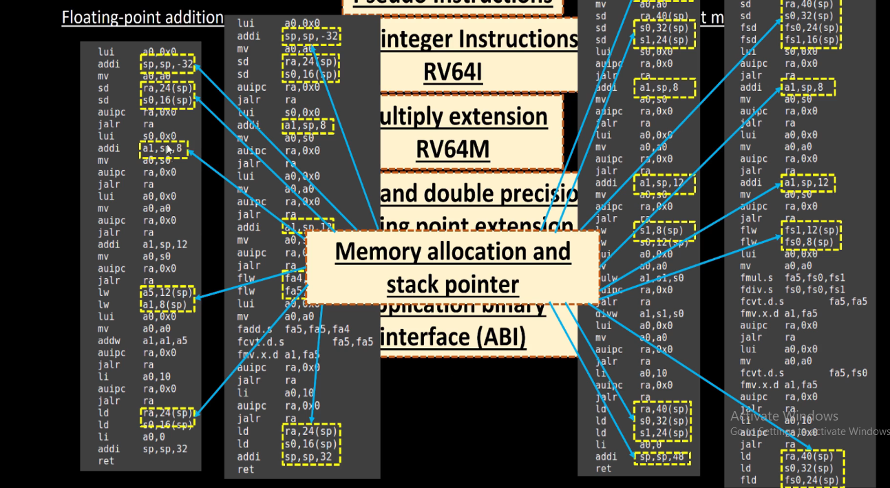
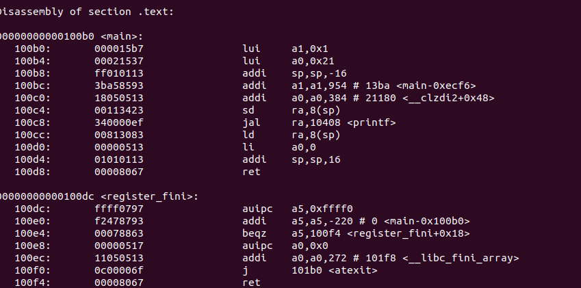
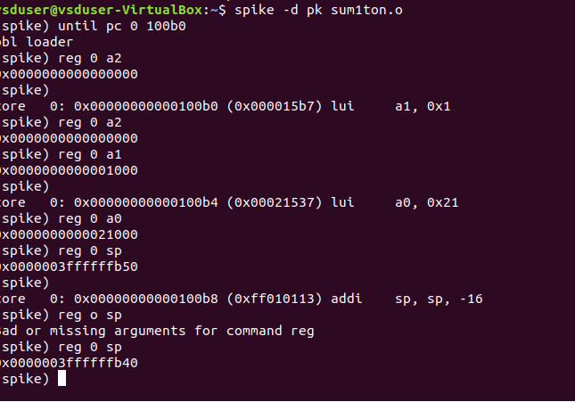

### RISC-V:
RISC-V is an open-source Reduced Instruction Set Computing (RISC) architecture designed for flexibility, scalability, and efficiency in modern computing. Unlike proprietary ISAs, RISC-V is freely available, enabling innovation in hardware development without licensing restrictions. It features a modular design, allowing implementations to be tailored for applications ranging from embedded systems to high-performance computing. The architecture supports 32-bit, 64-bit, and 128-bit variants, along with optional extensions for floating-point, vector processing, and atomic operations. With growing industry adoption, RISC-V is becoming a key player in microprocessor, SoC, and FPGA development, driving the future of open-source hardware.
|  |
| :--------------------------------------------------: |
|           RISC-V      |


### INSTRUCTION SET ARCHITECTURE:
An Instruction Set Architecture (ISA) is the interface between hardware and software in a computer system. It defines the set of instructions that a processor can execute and acts as a blueprint for how software communicates with the hardware. 

#### Types of ISA:
1. RISC (Reduced Instruction Set Computer):
- Simple instructions, fixed-length, optimized for performance (e.g., RISC-V, ARM).
2. CISC (Complex Instruction Set Computer):
- Complex instructions, variable length, hardware-intensive (e.g., x86).
3. VLIW (Very Long Instruction Word):
- Executes multiple instructions simultaneously (e.g., Itanium).
  
### FROM APPS TO HARDWARE:
We see that apps run on our laptops,mobile phones etc. They are all hardware. How does this happen?So,there is an interaction between apps and hardware, i.e system software.
#### SYSTEM SOFTWARE:
System software converts high level programming language like c,c++,java or python to binary level language which is understand by the hardware.
|  |
| :--------------------------------------------------: |
|           System software      |


The major components in system software are

1.Operating system

2.Compiler

3.Assembler


Os generally handles input/output operations,allocates memory, and does low level operations and other part of the operating system converts into assembly language.
Apps are written in high level languages like c,c++. they are fed to the compiler. We have a set of instructions. These instructions are dependent on hardware. The hardware may belong to mips,intel etc.

we obtain a *exe files. The obtained *exe files are fed to the assembler.The job of assembler is to convert *exe file into binary language. This is given to hardware, now it generates ouptut.


So, in general, The Instruction set Architecture is fed to the assembler through RISC-V assembly language. We write a RTL(Register Transfer level) snippet which understands instructions. Then we get  a netlist for given RTL. It is implemented to hardware.


### Understanding instructions:

When you run a c program on your compiler, after compiling we get a set of instructions.

### Pseudo instructions:
Instructions like mv,li,ret are said to be pseudo instructions.In RISC-V, pseudo-instructions are assembler-level instructions that do not exist as actual machine instructions but are instead translated into one or more real RISC-V instructions by the assembler. These pseudo-instructions improve code readability and simplify programming. 
Examples: mv, li,ret


### Base integer instructions:

The Base Integer Instructions in RISC-V (RV32I and RV64I) include arithmetic, logical, shift, load/store, and control flow instructions. These instructions are essential for general-purpose computation and form the foundation of RISC-V assembly programming.  Examples : addi,sd,auipo,jalr.


**Multiply extensions:**
Multiply Extension (M Extension) in RISC-V adds hardware support for multiplication and division operations. It is an optional extension, meaning it is not included in the base integer instruction set (RV32I or RV64I) but is commonly supported in performance-critical applications.
If the instructions does both integer and multiplication,then its nomeclature changes to **RV64MI.**


### Single and Double Precision Floating-Point Extensions in RISC-V (F & D Extensions)

The Floating-Point Extensions in RISC-V include:

- F Extension: Single-precision (32-bit floating-point)
-  D Extension: Double-precision (64-bit floating-point)
  
These extensions provide efficient computation for applications requiring high-precision math, such as scientific computing, graphics, AI, and machine learning. They are fmul,fdiv,fsd,flw 


### Application binary interface
The Application Binary Interface (ABI) in RISC-V defines conventions for function calling, register usage, memory layout, and system interaction to ensure compatibility between compiled programs and the operating system or runtime environment. It specifies how function arguments are passed (typically using registers like a0–a7 for the first few arguments and the stack for additional ones), how return values are handled (a0 and a1 for primary and secondary return values), and which registers must be preserved across function calls (callee-saved registers such as s0–s11). The ABI also defines stack alignment rules, floating-point register usage (if applicable), and calling conventions for different privilege levels. Different ABIs exist for RISC-V, such as ILP32 (for 32-bit systems) and LP64 (for 64-bit systems), with variations like ILP32F or LP64D to indicate floating-point support. These conventions  ensurethat software compiled by different tools or written in different languages can interoperate smoothly within the RISC-V ecosystem. 


### Memory allocations and stack pointer:
In RISC-V, memory allocation using the stack is managed by the stack pointer (sp) (x2), which tracks the top of the stack. The stack is used for storing function call information, local variables, and register states. It grows downward in memory, meaning each function call or local variable allocation decreases the value of sp, while deallocation (function return) increases it. To maintain proper execution and prevent corruption, the stack must be 16-byte aligned. During a function call, registers like the return address (ra) and callee-saved registers (s0–s11) may be pushed onto the stack, ensuring they are restored correctly before returning. Efficient stack management is essential for maintaining program stability and preventing stack overflow errors.



### 64-Bit number system for unsigned Numbers:
 A 64-bit number system for unsigned numbers, values are represented using 64 bits, meaning each number ranges from 0 to 2<sup>64</sup> . Since unsigned numbers do not support negative values, all 64 bits are used to store positive values. 64  bit is divided into two 32 bits.entire 64 bit is called a double word. Each 32 bit is called a word.  

Maximum Value (Decimal 2<sup>64</sup>− 1 ) → Binary: 1111111111111111111111111111111111111111111111111111111111111111 


### 64-Bit number system for signed Numbers:
In a 64-bit number system for signed numbers, values are represented using two’s complement notation, where the most significant bit (MSB) serves as the sign bit. If the MSB is 0, the number is positive, while an MSB of 1 indicates a negative number. This system allows for a range from -9,223,372,036,854,775,808 2<sup>63</sup> to 9,223,372,036,854,775,807 (2<sup>63</sup> −1). Positive numbers are stored in standard binary form, while negative numbers are represented by inverting all bits and adding 1. This approach simplifies arithmetic operations and ensures efficient hardware implementation. The two’s complement system also eliminates the need for separate representations of positive and negative zero, making calculations more streamlined. Signed 64-bit numbers are widely used in applications requiring both positive and negative values, such as timestamps, addressing schemes, and large-scale computations. 

## LABS
Let’s write c code for sum 1 to n natural numbers. 

```c
 #include <stdio.h>
int main(){
int i, sum=0,n=100;
for (i=0; i<=n;i++){
sum= sum+i;
}printf(" the sum of natural numbers upto 5 is %d\n" , sum);
return 0;
}
```
- Run them as shown below
  

 
- now running on riscv simulator:
```c
  riscv64-unknown-elf-gcc -01 -mabi=lp64i -o sum1ton.o sum1ton.c
  ```


- to view assembly code:
 ```o
    riscv64-elf-objdump -d sum1ton.o
  ```
  
-  lets see main assembly code: In this each register adress varies by 4, no of instructions are 15 here.


-  now again run on riscv simulator by modifying the command to
   ```c
    riscv64-unknown-elf-gcc -Ofast -mabi=lp64i -o sum1ton.o sum1ton.c
    ```
-  by using Ofast number of instructions reduced to 12.


- the command to get the output through riscv compiker is
         spike pk sum1ton.o


- lets debug each instruction : to do that type command
        spike -d pk sum1ton.o
we have debug each and every instruction in assembly code 
  - to read a2, type reg  0 a2
  - to run next instruction, jst press enter
  - addi, sp, sp -16 tells you to subtract 16 from previous stored sp address and it updates the value


### Lab for signed and unsigned numbers

here is my c code for highest unsigned number
```c
#include <stdio.h>
#include <math.h>

int main(){
 long long int max = (long long int) (pow(2,10) * -1);
printf("highest number represented by long long int is %lld\n",max);
return 0;
}
```

after runing in riscv compiler , we get output as follows 


### c signed code 
```c
#include <stdio.h>
#include <math.h>
int main(){
long long int max = (int) (pow(2,63) -1);
long long int min = (int) (pow(2,63) * -1);
printf("highest number represented by long long int is %lld\n",max);
printf("lowest number represented by long long int is %lld\n",min);
return 0;
}
```
we get output as follows:


