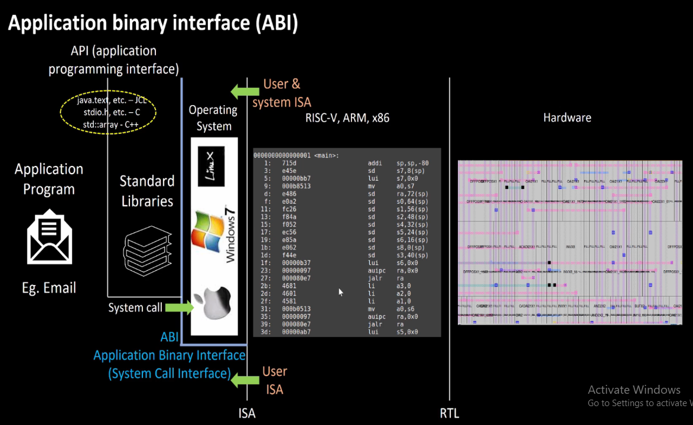
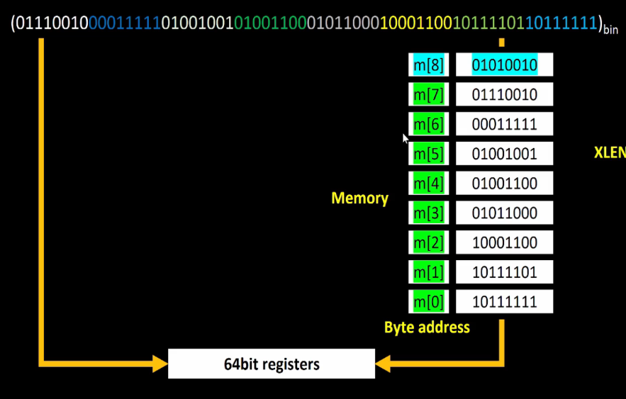
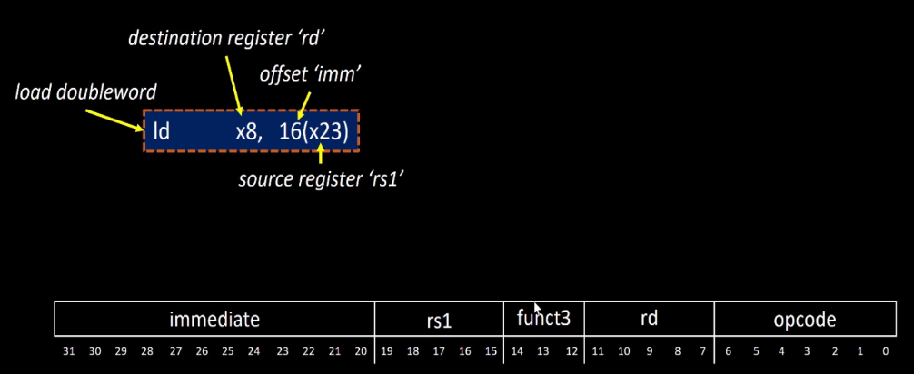
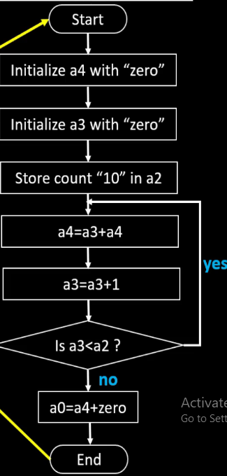
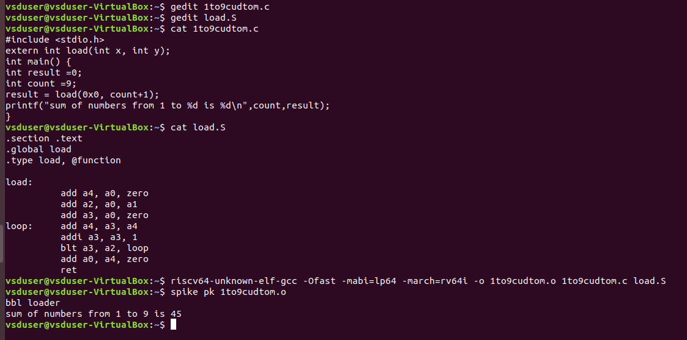
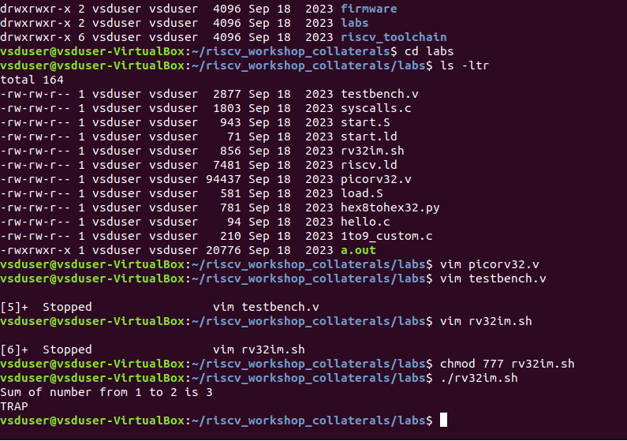

## APPLICATION BINARY INTERFACE

An Application Binary Interface (ABI) serves as a bridge between software and the underlying hardware or operating system. It defines rules for how programs interact at the binary level, including function calling conventions, register usage, memory layout, and system call mechanisms. By standardizing these interactions, an ABI ensures that compiled programs can run consistently across different environments without modification, enabling compatibility between software components, libraries, and system hardware. 


### Application Programming Interface (API):

An API defines a set of rules and functions that software applications use to communicate with other software or hardware. It provides a structured way for programs to request services such as file operations, network communication, or accessing system resources. APIs abstract complex system details, making development easier by providing predefined functions rather than requiring direct hardware interaction.


### User ISA & System ISA:

The Instruction Set Architecture (ISA) in RISC-V is divided into **User & System ISA and  User ISA**

**User & System ISA:**
ISA  is accessed by os and users directly, then it is called user and system ISA.

**User ISA:**  The os which can be only accessed by users is called User ISA.


### System call:
Application programmer can access the registers related to the RISCV architecture is called system call and this interface is called application binary interface, also called **system call inteface.**


### 64-bit Data Handling and Memory Addressing in RISC-V
In a 64-bit system, data can be managed in two primary ways:

1. Direct Register Loading: A 64-bit value can be loaded directly into a 64-bit register in RISC-V. Since registers are 64-bit wide, they can store an entire double word (8 bytes) without requiring multiple memory accesses.
    
2. Memory-Based Loading: Alternatively, the data can first be stored in memory and then loaded into a 64-bit register using load instructions. Since memory is byte-addressable, storing 64-bit data requires 8 consecutive memory locations.
    
### Memory Addressing and Endianness
Memory addressing determines how multi-byte data is stored in memory. There are two major byte-ordering conventions:
1. Little-Endian System:
-  The Least Significant Byte (LSB) is stored at the lowest memory address first, followed by higher-order bytes.
   
- Example (storing 0x1122334455667788 at address 0x1000)
2. Big-Endian System:
 
- The Most Significant Byte (MSB) is stored at the lowest memory address first. 
- Example (storing 0x1122334455667788 at address 0x1000)
- 

### Instruction Encoding in RISC-V Memory Operations :

**LD:**The LD (Load Double Word) instruction is used in 64-bit RISC-V (RV64) to load a 64-bit (8-byte) value from memory into a 64-bit register. 


**1. Opcode in Memory Instructions**

- The opcode is a 7-bit field that specifies the type of instruction.

**2. funct3 in Load/Store Instructions**
  
- The funct3 field (3 bits) specifies the size of data being loaded or stored.

**3. Immediate Field in Memory Instructions**
  
- The immediate value is used for address calculations in memory operations.
- It represents the offset from the base register.
- In load (LD) and store (SD) instructions:
- The offset (immediate) is 12 bits (signed).
  
- Used to compute the memory address
  
rd - Destination register (64-bit register where the data is loaded). 

rs1 - Base register containing the memory address. 

-  The instructions which has one immediate and two registers are called **I Type instsructions.**

### ADD:
The ADD instruction in RISC-V performs integer addition between two registers and stores the result in a destination register. It is part of the R-type (Register) instruction format and operates on 32-bit (RV32) or 64-bit (RV64) registers, depending on the architecture.

 **Syntax:** ADD rd, rs1, rs2
 
rd → Destination register (stores the result). 

rs1 → First source register (contains first operand).

rs2 → Second source register (contains second operand).

### 4. Instruction Encoding (R-Type Format):

The ADD instruction follows the R-type format in RISC-V, which consists of the following fields:

- Opcode (0110011) → Indicates R-type integer operations. 
- funct3 (000) → Specifies ADD operation. 
- funct7 (0000000) → Differentiates ADD from SUB (which uses 0100000).
- The instruction which perfrom only on registers is called  R type instructions.

### SD (Store Double Word) Instruction in RISC-V
The SD (Store Double Word) instruction in RISC-V is used in RV64 to store a 64-bit (8-byte) value from a register into memory. It follows the S-type (Store) instruction format and works only in 64-bit RISC-V (RV64) since RV32 does not support 64-bit operations.

**Syntax: SD a0, 16(s1)**   # Store the 64-bit value from register a0 into memory at address (s1 + 16)

 ### Instruction Encoding (S-Type Format):
The SD instruction follows the S-type format in RISC-V, which consists of the following fields:
Opcode (7-bit)
rs2 (5-bit)
rs1 (5-bit)
funct3 (3-bit)

-  Opcode (0100011) → Indicates a store instruction. 
- funct3 (011) → Specifies storing a double word (64-bit). 
-  Immediate (imm[11:0]) → Signed 12-bit offset for memory address calculation.

- The instruction which performs on only one immediate and only on source registers and to store data. They are called S-type instructions.


From all above instructions,in registers it uses ony 5 bits, so number if registers in riscv = 2^5 = 32;

### labs:
- writing assembly code for sum1ton.c
  
after writing c code and load.s as follows for above asm
```c
#include <stdio.h>
extern int load(int x, int y);
int main() {
int result =0;
int count =9;
result = load(0x0, count+1);
printf("sum of numbers from 1 to %d is %d\n",count,result);
}
```
**load.S**
```c
.section .text
.global load 
.type load, @function

load:
          add a4, a0, zero
          add a2, a0, a1
          add a3, a0, zero
loop:     add a4, a3, a4
          addi a3, a3, 1
          blt a3, a2, loop
          add a0, a4, zero
          ret
```

now lets run the same on riscv cpu- picorv32 




