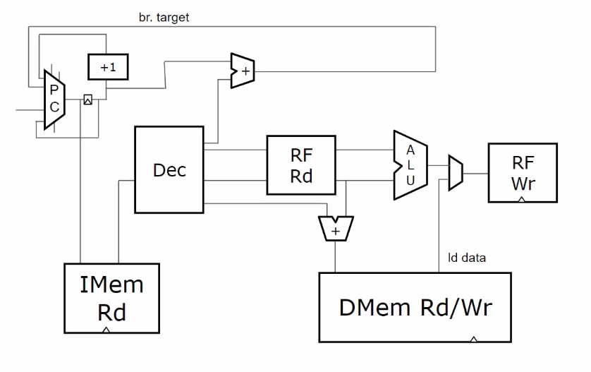

#  RISCV 

In the RISC V processor, the term RISC stands for “reduced instruction set computer” which executes few computer instructions whereas ‘V’ stands for the 5th generation. It is an open-source hardware ISA (instruction set architecture) based on the established principle of RISC.

## RISC V Block Diagram
The RV64 RISC V architecture is shown below. 

## RISC-V Block Diagram Explanation
This block diagram represents a single-cycle RISC-V processor architecture, where each instruction completes in one clock cycle. The key components of the architecture are explained in detail below:

### 1. Program Counter (PC)
- The Program Counter (PC) holds the memory address of the next instruction to be executed.
- It continuously updates after every instruction fetch, typically incrementing by 4 (for 32-bit instructions).
- If a branch or jump instruction is encountered, the PC is updated to the target address.
- It acts as the starting point for instruction execution, determining the sequence of operations.
- The PC sends its address to the Instruction Memory (IMem Rd) to fetch the next instruction.
- In case of a branch instruction, the new address is calculated and fed into the PC.
- The PC interacts with the +1 adder and multiplexer to decide the next instruction's address.
- If a branch is taken, the PC updates to the branch target address instead of the next sequential instruction.
- The PC is a fundamental element that drives the instruction fetch cycle in the processor.

  
### 2. Instruction Memory (IMem Rd)
- The Instruction Memory (IMem Rd) stores the machine code instructions of a program.
- The PC fetches the instruction stored at the current address.
- Instructions are in binary format and include operation codes (opcodes), registers, and immediate values.
- The fetched instruction is passed to the Decoder (Dec), which interprets it.
- The instruction memory operates in a read-only mode during normal execution.
- This component ensures that the correct instructions are fetched in the correct order.
- It plays a vital role in the fetch stage of the instruction cycle.
### 3. Decoder (Dec)
- The Decoder (Dec) interprets the fetched instruction and generates control signals.
- It extracts information such as the operation type (ALU, memory, branch, etc.), source and destination registers, and immediate values.
- The control signals dictate how other components (registers, ALU, memory) should behave.
- If the instruction is an arithmetic operation, the decoder signals the ALU.
- If the instruction is a load/store, the decoder activates memory access.
- It also identifies branch/jump instructions and enables the appropriate path in the control logic.
- The decoder is crucial for determining the correct flow of data and execution.
### 4. Register File Read (RF Rd)
- The Register File Read (RF Rd) block reads operands from the register file.
- It retrieves values stored in registers based on the instruction’s source register fields.
- In RISC-V, there are 32 general-purpose registers (x0 to x31), each 32-bits wide.
- Register x0 is hardwired to zero and cannot be modified.
- The RF Rd fetches two operand values required for ALU operations or memory instructions.
- These values are forwarded to the ALU or the memory unit for further processing.
- Register reading is a fundamental step before executing arithmetic or logical operations.
- This block ensures that the correct data is available for processing.
### 5. Arithmetic Logic Unit (ALU)
- The ALU performs arithmetic (addition, subtraction, multiplication) and logical (AND, OR, XOR) operations.
- It takes two operands from the register file and processes them based on the instruction type.
- The ALU is controlled by signals from the Decoder (Dec), which specify the operation type.
- The result of the ALU operation is sent to the Register File Write (RF Wr) or Data Memory (DMem).
- If the instruction is a branch, the ALU determines whether the condition is met.
- The ALU is a critical processing unit, responsible for executing computation-based instructions.
- It also plays a role in address calculations for memory instructions.
### 6. Data Memory (DMem Rd/Wr)
- The Data Memory (DMem Rd/Wr) block is responsible for reading and writing data in memory.
- It is used in load (LW) and store (SW) instructions, where data is transferred between registers and memory.
- When a load instruction (LW) is executed, data is fetched from memory and placed into a register.
- When a store instruction (SW) is executed, data from a register is stored in memory.
- The memory access is controlled by signals from the Decoder (Dec).
- The ld data (load data) line indicates data being read from memory.
- This block ensures that memory operations are correctly handled and executed.
### 7. Register File Write (RF Wr)
- The Register File Write (RF Wr) stores computed results back into registers.
- It receives input from the ALU (for computation results) or Data Memory (DMem) (for loaded values).
- The write operation occurs at the end of an instruction cycle.
- The register file allows only one write operation per cycle to maintain consistency.
- Ensures that computational results are saved and available for the next instructions.
- This block is essential for completing the instruction execution process.
### 8. Branch Target Calculation
- This component calculates the new PC value in case of branch instructions.
- It takes input from the ALU to determine if a branch condition is met.
- If the condition holds true, the PC is updated with the branch target address.
- If the condition is false, the PC increments normally.
- Branching ensures control flow changes such as loops and conditional execution.

